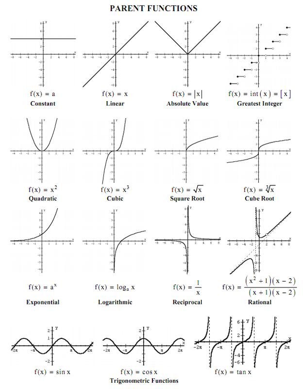

# Function 

A [function](https://simple.wikipedia.org/wiki/Function_(mathematics)) is a [mathematical](../maths.md) object that takes an input and produces an output (number, vector, etc).

%%
Function hyperboliques: sinus, cosinus, tangente
%%

## Notation

$$f: X^n \to Y$$
Function $f$ from [domain](https://en.wikipedia.org/wiki/Domain_of_a_function) $X$ with $n$ variables to [codomain](https://simple.wikipedia.org/wiki/Range_(mathematics)) $Y$.
Note that there is multiple example of different types of domains and codomains. Find more [here](https://en.wikipedia.org/wiki/Function_(mathematics)).

## Convex / concave

There is two methods two know if a function is [convex](https://simple.wikipedia.org/wiki/Convex_function):

- If we trace a line between two points from the function and that it's on or above the function (in the interval between those two points)
- If the 2nd [derivative](derivative.md) is positive (on a given interval)
  $f(x)=x^2$ is convex as $f'(x)=2x$, $f''(x)=2 > 0$

A function $f(x)$ is [concave](https://en.wikipedia.org/wiki/Concave_function) when its opposite $-f(x)$ is convex.