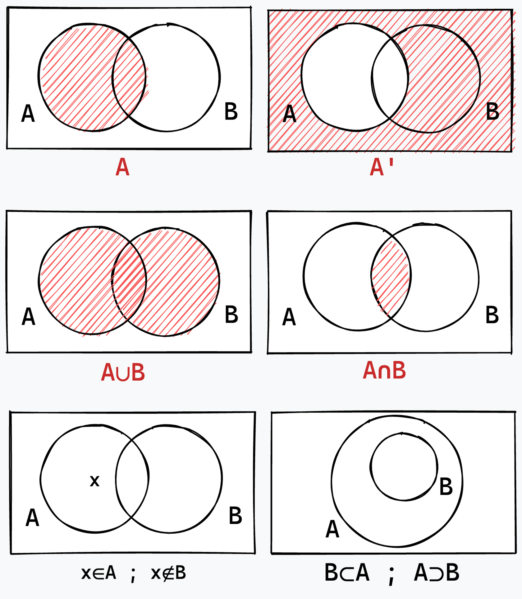

# Sets

[Mathematical sets](https://wikipedia.org/wiki/set_(mathematics)) are collections of objects that can represent different things, such as numbers, variables, and shapes. They are useful for defining relationships and connections between objects, as well as for statistical and analytical purposes.

