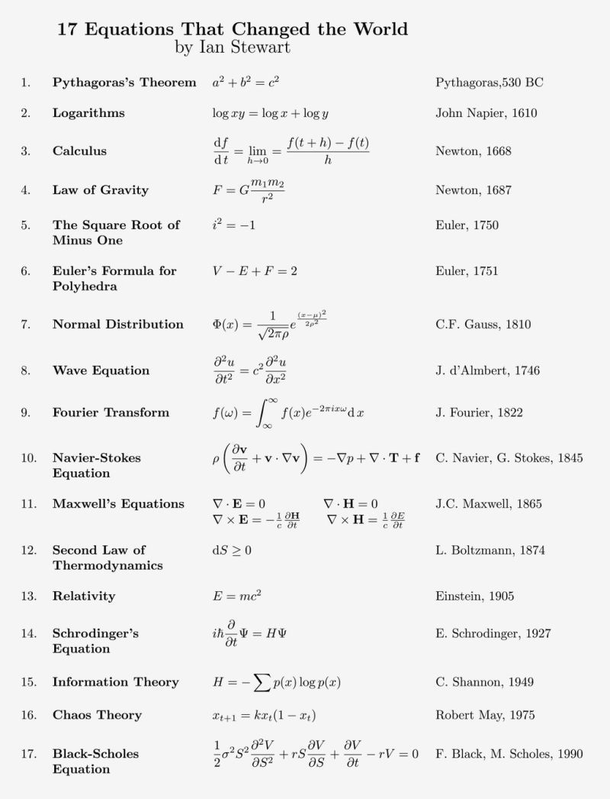

# Math

## Stuff to sort

- https://betterexplained.com/articles/an-intuitive-guide-to-exponential-functions-e/
- https://www.quora.com/How-does-the-formula-n-n-1-2n-1-6-come?share=1
- https://wikipedia.org/wiki/Knuth%27s_up-arrow_notation
- https://wikipedia.org/wiki/Conjecture
- https://wikipedia.org/wiki/Millennium_Prize_Problems

Here are some extreme numbers compared to real-world cases

| Number           | Real-world equivalent                 |
| ---------------- | ------------------------------------- |
| 13 billions                 | Age of the universe                                      |
| $5\times10^{80}$ | Number of atoms in the know