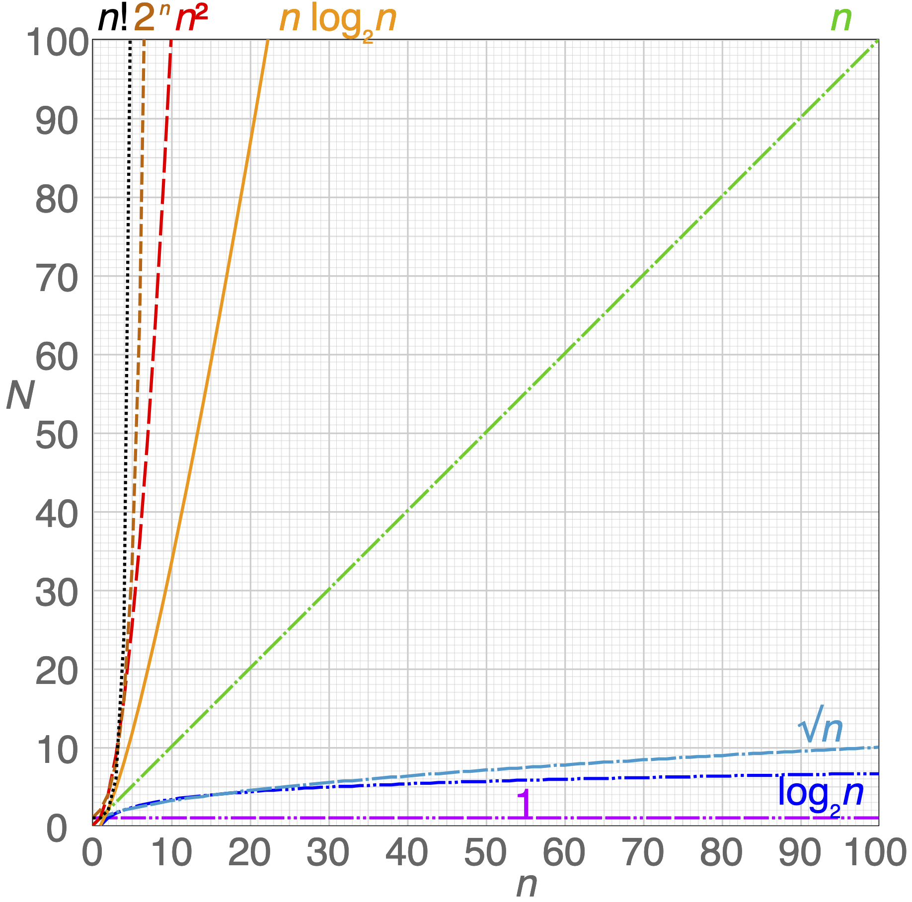

# Time complexity

We define [time complexity](https://wikipedia.org/wiki/time_complexity) as the time a computer take to run an algorithm.

## Big O notation

The [Big O](https://wikipedia.org/wiki/big_o_notation) notation shows how a function's performance and get bigger as the size of its input increases.

| Notation | Name | Example |
| ---- | ---- | ---- |
| $O(1)$ | [constant](https://wikipedia.org/wiki/constant_time) | Determine if number is even or odd |
| $O(\log n)$ | [logarithmic](https://wikipedia.org/wiki/logarithmic_time "logarithmic time") | [binary-search](search/binary-search.md) |
| $O(n)$ | [linear](https://wikipedia.org/wiki/linear_time "linear time") | Find item in an unsorted list/array |
| $O(n\log n)$ | [linearithmic](https://wikipedia.org/wiki/linearithmic_time "linearithmic time") | (to complete) |
| $O(n^2)$ | [quadratic](https://wikipedia.org/wiki/quadratic_time "quadratic time") | (to complete) |
| $O(n^c)$ | [polynomial](https://wikipedia.org/wiki/polynomial_time "polynomial time") | (to complete) |
| $O(2^n)$ | [exponential](https://en.wikipedia.org/wiki/Exponential_time) | (to complete) |
| $O(n!)$ | [factorial](https://wikipedia.org/wiki/factorial "factorial") | (to complete) |

Algorithms usually have best/worst case scenario, depending of which input number is given (e.g., if we randomly find the result on the first try).

## Complexity classes

Based on their time complexity, algorithms can be categorised in different [complexity classes](https://en.wikipedia.org/wiki/Complexity_class). You can check the [complete list](https://en.wikipedia.org/wiki/List_of_complexity_classes), but here are some of the most common ones.

### P

[P](https://en.wikipedia.org/wiki/P_(complexity)) is a *polynomial-time* solvable problem
- It takes $O(n^c)$ or less to *find* (or *verify*) a solution

**Examples**
- Sorting algorithms: [quicksort](sort/quicksort.md), bubble sort, merge sort, etc.
- Shortest path in a graph

### NP

[NP](https://en.wikipedia.org/wiki/NP_(complexity) "NP (complexity)") is a *non-polynomial-time* solvable problem
- It takes more than $O(n^c)$ to *find* a solution
- But the solution is *verifiable* in polynomial time

**Examples**
- Sudoku puzzles. You can easily check if row and columns contains numbers 1-9, but it takes more time to complete it.
- [Traveling Salesman](problems/traveling-salesman.md)
- [Knapsack](problems/knapsack.md)