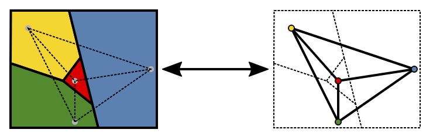

# Graph coloring problem

[Graph coloring](https://en.wikipedia.org/wiki/Graph_coloring) problems include the coloring (or labeling) of vertices in a [graph](../graph/index.md).

For example, we want to color a map where the countries which are neighbours don't have the same colors. The problem is to find the minimal number of different colors to apply.

## Resources

- [Four color theorem](https://en.wikipedia.org/wiki/Four_color_theorem) – Wikipedia