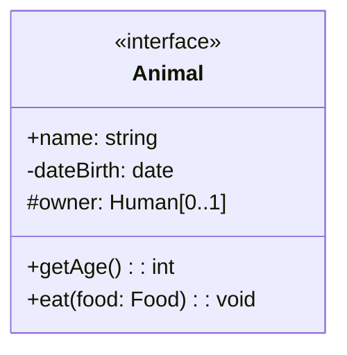

# Class diagram

The [class diagram](https://wikipedia.org/wiki/class_diagram) show the system's classes, attributes, methods and relationships. It's mostly used in [OOP](../../../paradigms/object-oriented.md).

## Notation

### Defining class

You define your class with three sections:

1. **Name**: Stereotype (e.g `«enum»`, `«interface»`), class name
2. **Properties**: Visibility, property name, data type, cardinality
3. **Methods**: Visibility, method name, parameters, return data type

### Visibility

- `+public` – Access from any other classes
- `-private` – Access from inside its own classes
- `#protected` – Access from inside its own classes and sub-classes
- `~package` – Access from classes from the same package (default)
- `_static_` (underlined) – Access without instantiating class

### Relationship

| Name           | Example | Explanations                         |
| -------------- | ------- | ------------------------------------ |
| Association               | `A--B`        | `A` is associated to `B`                                      |
| Generalization | `A-->B` | `A` inherits from `B`                |
| Aggregation    | `A--oB` | `A` is a *dependent* piece of `B`    |
| Composition    | `A--*B` | `A` is an *independent* piece of `B` |
| Realization    | `A..>B` | `A` inherits from interface `B`      |

Read more: [Relations in OOP](../../../paradigms/object-oriented.md#relations)

#### Cardinality

Also called multiplicity, [cardinality](https://wikipedia.org/wiki/cardinality_(data_modeling)) indicates how many instances of a class can be present in another class.

- **One-to-one**: `A 1--1 B`
- **One-to-many**: `A *--1 B`
- **Many-to-many**: `A *--* B`

We can also specified more precises numbers or define ranges:
`0..1`, `0..*`, `1..n`, etc.

## Example

## Resources

- [Class and Object Diagrams Overview](https://www.uml-diagrams.org/class-diagrams-overview.html) – UML diagrams
- [Class diagrams syntax](https://mermaid.js.org/syntax/classdiagram.html) – Mermaid modeling language