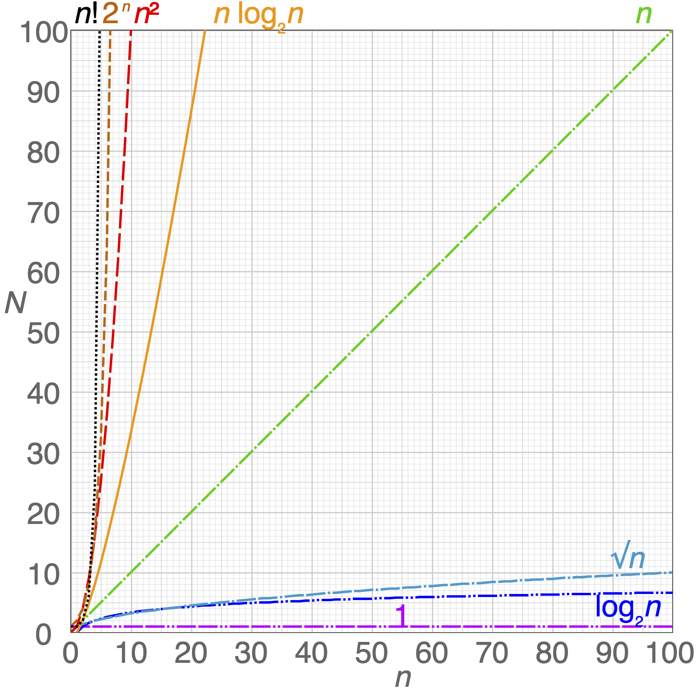

# Time complexity

We define [time complexity](https://wikipedia.org/wiki/time_complexity) as the time a computer take to run an [algorithm](algorithms.md).

The time to run operations grow with the input size, e.g. items in an array or vertices and edge in a [graph](../data/database/nosql/graph.md).

## Approaches

Depending on the size of the problem, we have to balance speed over precision. If we have a complex problem with a lot of data, maybe we'll need to find a good solution quickly rather than the perfect solution slowly.

| Category | Size | Typical approach |
| ---- | ---- | ---- |
| Tiny | Exhaustive | $n\approx10$ |
| Small | Implicit | $10\le n \le 10^2$ |
| Standard | [Metaheuristic](algorithms.md#Terminology) | $10^2 \le n \le 10^4$ |
| Big | Decomposition | $10^4 \le n \le 10^7$ |
| Huge | Big data | $n \gt 10^7$ |

## Notation

### Big O

The [Big O notation](https://wikipedia.org/wiki/big_o_notation) shows how an algorithm's performance get bigger as its input $n$ increases. In short: how does the time it takes to do the operation growth as we add more elements.

| Notation | Name | Example |
| ---- | ---- | ---- |
| $O(1)$ | [constant](https://wikipedia.org/wiki/constant_time) | Determine if number is even or odd |
| $O(\log n)$ | [logarithmic](https://wikipedia.org/wiki/logarithmic_time "logarithmic time") | [Binary search](search/binary-search.md) |
| $O(n)$ | [linear](https://wikipedia.org/wiki/linear_time "linear time") | Find item in an unsorted list/array |
| $O(n\log n)$ | [linearithmic](https://wikipedia.org/wiki/linearithmic_time "linearithmic time") | (to complete) |
| $O(n^2)$ | [quadratic](https://wikipedia.org/wiki/quadratic_time "quadratic time") | (to complete) |
| $O(n^3)$ | cubic | (to complete) |
| $O(n^c)$ | [polynomial](https://wikipedia.org/wiki/polynomial_time "polynomial time") | (to complete) |
| $O(2^n)$ | [exponential](https://en.wikipedia.org/wiki/Exponential_time) | (to complete) |
| $O(n!)$ | [factorial](https://wikipedia.org/wiki/factorial "factorial") | (to complete) |

Keep in mind notation can have more than one type of input. Two different lists could involve a $O(n+m)$ type of complexity, or $O(n\times m)$ if they depend on each other. We typically use notation like $O(|V|+|E|)$ in [graphs](graph/graph.md), where the number of vertices and edges can influence the performances.

**Example**
Let say there is 100 persons, you give a coin to one of them, and you have to find it. They can only answer by yes or no.

| Scenario | Algorithm | Complexity |
| ---- | ---- | ---- |
| Give the coin to someone | You throw the coin in the group without looking | $O(1)$ |
| The person who has the coin is the only one to know | You ask each person individually "do you have the coin?". | $O(n)$ |
| Everybody know where is the coin | You divide the group in half and ask in which sub-group the coin is. You repeat the processus until you find it. | $O(\log n)$ |
| Only one person know on which person the coin is hidden | You take the 1st person and ask for every person if they have the coin. You repeat the processus for every other person. | $O(n^2)$ |

### Big Omega / Theta 

As Big O notation define the **worst-case** scenario for an algorithm, Big Omega and Big Theta define respectively the **best** and **mean** case.

**Example**
Back to previous example: there is 100 persons, one of them has coin. You ask to each of them if they have it.

- **Best case**: you're lucky and find the person on the first time. It took you $\Omega(1)$ time.
- **Worst case**: the last person you asked is the one with the coin. It took $O(n/2)$ time.
- **Mean case**: on average, you need to ask ~50 persons to find the coin, so $\Theta(n)$ time.

### Simplifications

We usually simplify the complexity notation, because it's the growth rate over time that is really interesting.

In the previous example, finding a coin among 100 persons would need to check ~50 persons on average, so $\Theta(n/2)$. What really matters is that the more persons there is, the more time we'll take to find the coin: this growth in *linear*. So, we drop constants numbers as it's not vey relevant. The average time complexity is $\Theta(n)$.

**Some examples**

| Example | Simplification | Explanations |
| ---- | ---- | ---- |
| $O(n+n²)$ | $O(n²)$ | $n^2$ will have more impact over $n$, so we simplify to a quadratic complexity. |
| $O(n \times n^2)$ | $O(n^3)$ | As it's a multiplication, we simplify mathematically the term. The growth is the cubic. |

## Complexity classes

Based on their time complexity, algorithms can be categorised in different [complexity classes](https://en.wikipedia.org/wiki/Complexity_class). 
You can check the [complete list](https://en.wikipedia.org/wiki/List_of_complexity_classes), but here are some of the most common ones.

### P

[P](https://en.wikipedia.org/wiki/P_(complexity)) is a *polynomial time* solvable problem.

It takes $O(n^c)$ or less to *find* (or *verify*) a solution. Since those problem are relatively easy, we can use efficient algorithms to solve them.

**Examples**
- Sorting algorithms: [quicksort](sort/quicksort.md), bubble sort, merge sort, etc.
- Shortest path in a graph

### NP

[NP](https://en.wikipedia.org/wiki/NP_(complexity) "NP (complexity)") is a *non-polynomial time* solvable problem. 
It takes more than $O(n^c)$ to *find* a yes/no solution (e.g. is the puzzle complete), but it's *verifiable* in polynomial time.

For example, you can easily check if a sudoku puzzle is solved by check the row and columns containing the 9 numbers, but it takes more time to complete it.

Algorithms usually rely on approximations (e.g heuristics) to find solutions for these kind of problems.

> [!NOTE]
> NP stands in fact for *Nondeterministic Polynomial*. It basically means that it *should* be solvable in polynomial time with theoretical nondeterministic machines.

**Sub-classes**
- [NP-complete](https://en.wikipedia.org/wiki/NP-complete): if we find a polynomial time algorithm to solve these problems, we could solve any other NP problems.
- [NP-hard](https://en.wikipedia.org/wiki/NP-hardness): it's at least as hard as NP-complete problems, but it's also non-polynomial to *verify* the solution.

**Examples**
- Finding prime number (NP)
- [Traveling Salesman](problems/traveling-salesman.md), [Knapsack](problems/knapsack.md), [Graph coloring](problems/graph-coloring.md) (NP-complete)
- [Halting](problems/halting.md) (NP-hard)

## Problems

- [P vs. NP](problems/p-vs-np.md)

## Resources

- [bigocheatsheet.io](https://bigocheatsheet.io) – Cheatsheet containing data structures and algorithms
- [bigocheatsheet.com](https://www.bigocheatsheet.com/) – Overview with chart and tables
- [Big O notation in 5 minutes](https://www.youtube.com/watch?v=__vX2sjlpXU) – Youtube