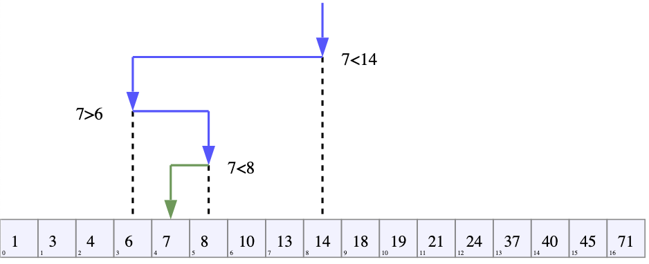
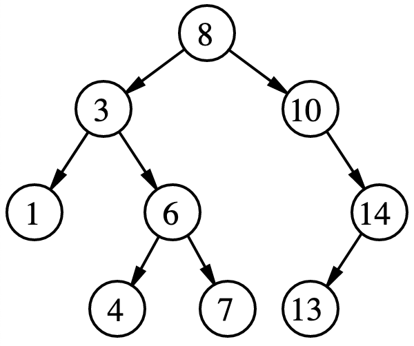

# Binary search

The [binary search](https://wikipedia.org/wiki/binary_search) is used to find a value by splitting the interval into two at each iteration. For that, the list/array should be sorted.

We can find the final result if it's a discret interval, like an index in a sorted list. However, if it's a continuous, we need to give a stopping condition (precision).

## Binary search tree

A [binary search tree](https://en.wikipedia.org/wiki/Binary_search_tree) is like a [binary tree](../../data/data-structure/tree.md#Binary%20tree), but one child node is larger while the other is smaller than the parent node.

When nodes are inserted or deleted from the tree, it has to re-balance itself to keep this *left→larger, right→smaller* logic.

| [Time complexity](../complexity.md)  | Mean case  | Worst case  |
|---|---|---|
|Search|$\Theta(\log n)$|$O(n)$|
|Insert|$\Theta(\log n)$|$O(n)$|
|Delete|$\Theta(\log n)$|$O(n)$|

## Complexity

[Time complexity](../complexity.md)
- **Worst case**: $O(\log n)$
- **Best case**: $\Omega(1)$
- **Mean case**: $\Theta(\log n)$

Space complexity
- **Worst case**: $O(1)$