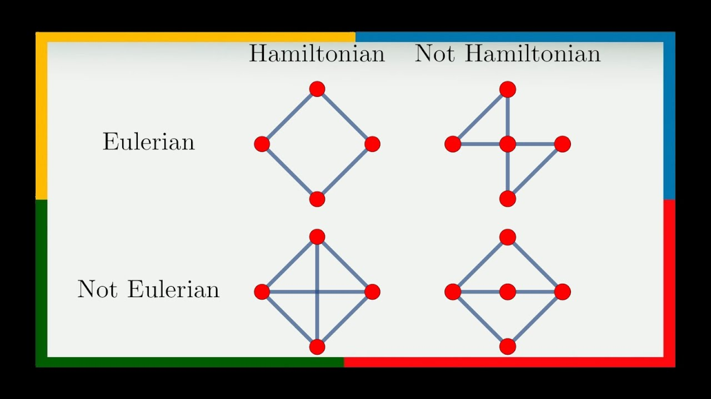
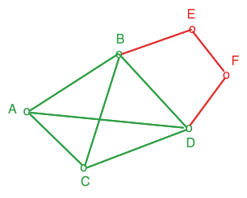

# Graph

A [graph](https://en.wikipedia.org/wiki/Graph_(discrete_mathematics)) is a set of *vertices* (points) connected by *edges* (lines).

We use specifics [graph](../../algorithms/graph/graph.md) to efficiency resolve related problems.

## Structure

$$G=(E,V)$$
- $G$: *graph*
- $V$: *vertices*. The nodes of the graph.
- $E$: *edges*. Directed or undirected links between the vertices.

### Adjacency matrix

An [adjacency matrix](https://wikipedia.org/wiki/adjacency_matrix) helps to quickly look up a single edge and allows for quick addition of edges.

The graph must be (almost) complete and it can cost performance depending on its size.

**Performances**

$V$ is the number of vertices

- Browse a row or a column of the matrice (adjacent node/edge): $O(V)$
- Store the matrix: $O(V²)$
- Browsing all edges of the graph: $O(V²)$

### Adjacency list

An [adjacency list](https://wikipedia.org/wiki/adjacency_list) provides quick lookup of one vertex and allows for quick addition of new edges and vertices. However, searching for a single edge requires traversing the entire list.

**Performances**

$V$ is the number of vertices
$E$ is the number of edges

- Store the lists: $O(E+V)$ 
- Browse all vertices of the graph: $O(E+V)$
- Check if $(v_1,v_2)$ is a vertice: $O(\deg(v_i))$
- Browse adjacent vertices of $v_i$ : $O(\deg(v_i))$

## Types 

### Directed vs. undirected

*(WIP)*

### Eulerian vs. Hamiltonian

- [Eulerian path](https://simple.wikipedia.org/wiki/Eulerian_path): a path that visits each edge of the graph only once
- [Hamiltonian path](https://simple.wikipedia.org/wiki/Hamiltonian_path): a path that contains each vertex only once (e.g. [Traveling Salesman](../../algorithms/problems/traveling-salesman.md))

Source: [VisualMath](https://www.youtube.com/watch?v=CEOGcSCTar8) – Youtube

### Bipartite

A graph is [bipartite](https://en.wikipedia.org/wiki/Bipartite_graph) if the vertices can be split into two subsets

### Clique

A [clique](https://en.wikipedia.org/wiki/Clique_(graph_theory)) is when you take a subset of vertices and all these vertices are connected together.

On the left, $(A,B,C,D)$ are a clique because they are all adjacent to each other. It's not the case for $(B,E,F,D)$

## Algorithms

- Find if path exists between 2 nodes
	- Directed graphes: Tarjan, Kosaraju
	- Undirected graphes: DFS, BFS 
- Find shortest path between 2 nodes
	- Bellman-Ford
	- [Dijkstra](../../algorithms/graph/dijkstra.md) (positive weights only)
	- [Floyd-warshall](../../algorithms/graph/floyd-warshall.md) (positive and negative, find shortest path for all nodes)
- Connect all vertices together with edges subsets ([Minimum Spanning Tree](tree.md#Minimum%20Spanning%20Tree))
	- [Prim](../../algorithms/graph/prim.md) (denses graphs)
	- [Kruskal](../../algorithms/graph/kruskal.md) (less denses graphs)