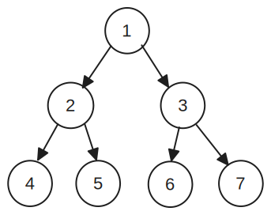
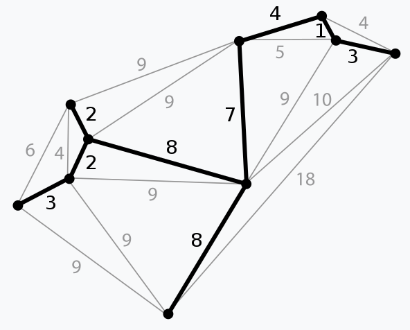

# Tree

A [tree](https://en.wikipedia.org/wiki/Tree_(data_structure)) is a hierarchical data structure close to a [graph](graph.md), with some constraints:
- It has a root node
- Each node has only one parent (except for the root node)
- It's acyclic (no loops)

## Types

### Binary tree

In a [binary tree](https://en.wikipedia.org/wiki/Binary_tree), each item within the tree has at most two children.

### Tree rotation

 A [tree rotation]( https://wikipedia.org/wiki/Tree_rotation) changes the structure of the tree without interfering with the order of the elements.

### Spanning tree

A graph can contains a [spanning tree](https://en.wikipedia.org/wiki/Spanning_tree), which connect all its vertices together, without create loops.

#### Minimum Spanning Tree

A [Minimum Spanning Tree](https://en.wikipedia.org/wiki/Minimum_spanning_tree) (MST) is a spanning tree which connect vertices together by edges with minimum total weight.

