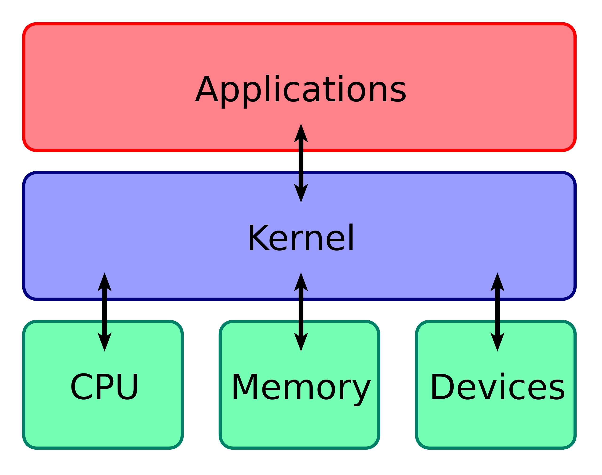

# Kernel

The [kernel](https://wikipedia.org/wiki/kernel_(computer_science)) is a central part of the operating system. It communicates with the hardware and manage resources, such as memory, drivers, processes, network, files, etc.

## Assembly

- https://peterhigginson.co.uk/LMC/