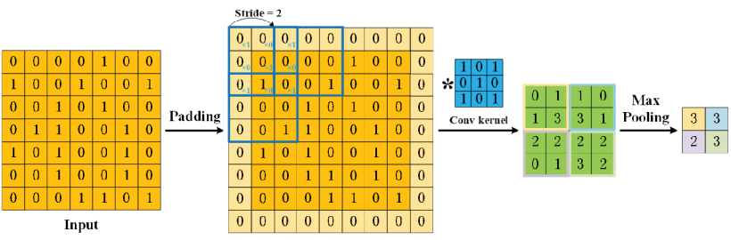

# Convolutional Neural Network

A [Convolutional Neural Network](https://en.wikipedia.org/wiki/Convolutional_neural_network) (CNN) is mainly used in [Computer Vision](../../applications/computer-vision.md) and [generative](../../applications/generative-ai.md) images. In an image, the pixels are treated by blocks using a *kernel*. It's used to capture image's features, like edges or textures

## Some examples

- **[U-Net](https://en.wikipedia.org/wiki/U-Net)**: used for image segmentation and [diffusion model](../diffusion/diffusion.md)
- **[Inception](https://en.wikipedia.org/wiki/Inception_(deep_learning_architecture))**: used for [computer vision](../../applications/computer-vision.md)

## Resources

### Papers

- [doi:10.1109/TNNLS.2021.3084827](https://doi.org/10.1109/tnnls.2021.3084827) – A Survey of Convolutional Neural Networks: Analysis, Applications, and Prospects