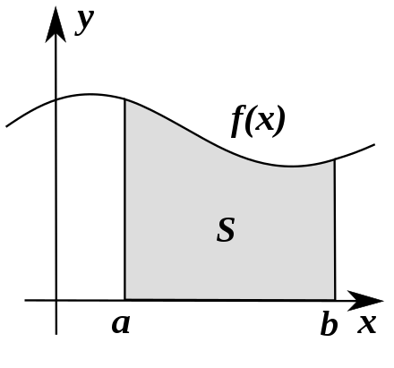
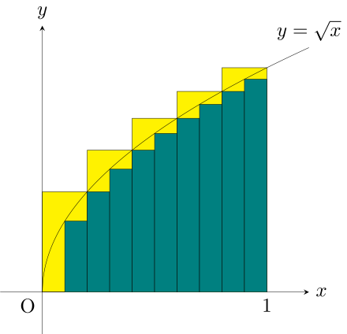

# Integral

An [integral](https://en.wikipedia.org/wiki/Integral) defines the *area under the curve* of a [function](function.md). It's the reverse of a [derivative](derivative.md)

Here is an example of an integral from $a$ to $b$, defining the area $S$.

$$\int_{a}^{b} f(x) dx$$

## How the area is calculated

It's generally difficult to calculate an area include in curved shapes. To do so, we simplify the shape by splitting it with simple rectangles. The sum of these rectangles approximate the area. The more rectangle we add, the more precise the area is.

To have an exact value, we split an infinite number of time, denoted by $dx$.

$$\int_0^1 \sqrt{x} \ dx$$

