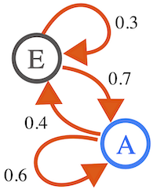

# Markov chain

[Markov chain](https://en.wikipedia.org/wiki/Markov_chain) describe events and their probabilities depending of the current state.

From the example below, starting from event $E$, there's a 0.3 probability the next event is $E$ and 0.7 it's $A$.

