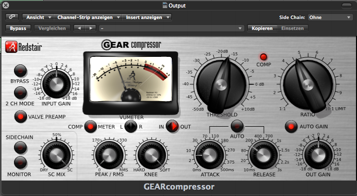

# Skeumorphism

[Skeumorphism](https://en.wikipedia.org/wiki/Skeuomorph) is a design trends that tend to imitates real-life object in interface or other object, usually to suggest their function and how to interact with.

**Examples**
- An app could imitate physical buttons, like we find in radios
- Electric light bulbs imitating the shape of candle flames

## References

- [Skeumorphism](https://www.nngroup.com/articles/skeuomorphism/) – NNgroup article