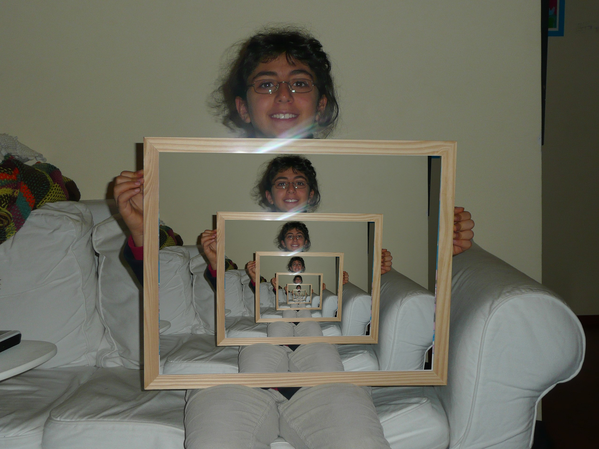

# Droste Effect

The [Droste effect](https://en.wikipedia.org/wiki/Droste_effect) is a visual [mise en abyme](https://en.wikipedia.org/wiki/Mise_en_abyme) where the image is recursively appearing within itself.

